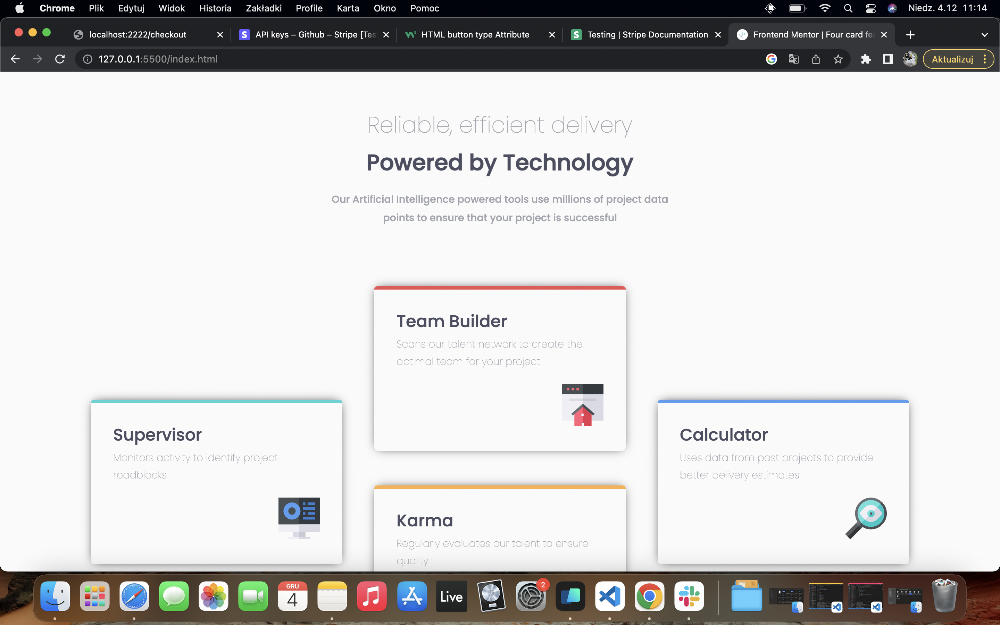

# Frontend Mentor - Four card feature section solution

This is a solution to the [Four card feature section challenge on Frontend Mentor](https://www.frontendmentor.io/challenges/four-card-feature-section-weK1eFYK). Frontend Mentor challenges help you improve your coding skills by building realistic projects.

## Table of contents

- [Overview](#overview)
  - [The challenge](#the-challenge)
  - [Screenshot](#screenshot)
  - [Links](#links)
- [My process](#my-process)
  - [Built with](#built-with)
  - [What I learned](#what-i-learned)
  - [Useful resources](#useful-resources)

## Overview

### The challenge

Subjects to practice:

- CSS grid

- RWD & Media Queries

Users should be able to:

- View the optimal layout for the site depending on their device's screen size

### Screenshot

### Links

- Challenge URL: [Frontend Mentor URL](https://www.frontendmentor.io/challenges/four-card-feature-section-weK1eFYK)

## My process

### Built with

- CSS Grid
- Mobile-first workflow

### What I learned

This simple project was a great way to refresh CSS grid skills, as well as focus on designing page for different screen sizes. This was also my first encounter with Media Queries, and Mobile-first design.

### Useful resources

- [CSS Grid Cheat Sheet](https://grid.malven.co/) - Great visual representation of grid concepts.
